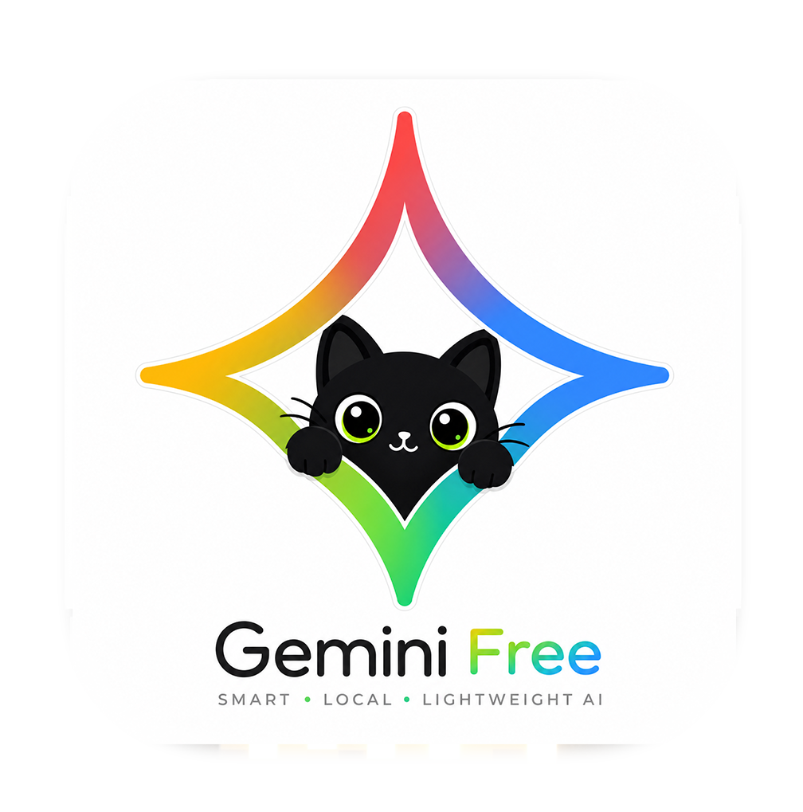

<p align="center">
  
</p>

<h1 align="center">Gemini Free</h1>

macOS 菜单栏应用，把 Gemini 网页端转成本地 OpenAI 兼容 API。纯 Swift，内存占用约 14MB。

基于 [gemini-web2api](https://github.com/Sophomoresty/gemini-web2api) 的协议逆向逻辑重写。

## 用法

双击 `Gemini Free.app`，菜单栏出现图标，服务起在 `localhost:8081`。

客户端填：Base URL `http://localhost:8081/v1`，Model 填 `gemini-3.6-flash`。

```bash
curl http://localhost:8081/v1/chat/completions \
  -H "Content-Type: application/json" \
  -d '{"model":"gemini-3.6-flash","messages":[{"role":"user","content":"你好"}]}'
```

通用二进制，Intel 和 Apple 芯片的 Mac 都能跑。

首次打开若提示"已损坏"或无法验证开发者，在终端跑一次：

```bash
xattr -dr com.apple.quarantine "Gemini Free.app"
```

（App 用 ad-hoc 签名、未做 Apple 公证，这是正常现象，跑一次即可。）

## 模型

免登录：`gemini-3.6-flash` `gemini-3.5-flash` `gemini-3.5-flash-thinking` `gemini-3.5-flash-thinking-lite` `gemini-auto` `gemini-flash-lite`

要 Gemini Advanced 付费 cookie：`gemini-3.1-pro` `gemini-3.1-pro-enhanced`（没 cookie 也能调，静默回退 Flash）

思考深度：模型名后加 `@think=N`，0 最深 4 最浅。

## 设置

点菜单栏图标 → 设置，可改端口、局域网开关、API Key 鉴权、Cookie 文件、代理、默认模型。配置存 `~/.config/gemini-web2api/config.json`，格式和原项目通用。

- **局域网访问**：默认开启（监听 0.0.0.0），同网段设备可用本机 IP 调用；关闭则仅本机（127.0.0.1）。
- **API Key 鉴权**：填一个或多个 Key（逗号分隔），客户端需带 `Authorization: Bearer <key>`；留空则免密。开放局域网时建议设置。

代理填 `http://127.0.0.1:7890` 这类 HTTP 代理即可。

## 编译

```bash
./build.sh
```

## 致谢

协议逆向来自 [Sophomoresty/gemini-web2api](https://github.com/Sophomoresty/gemini-web2api)。

MIT
