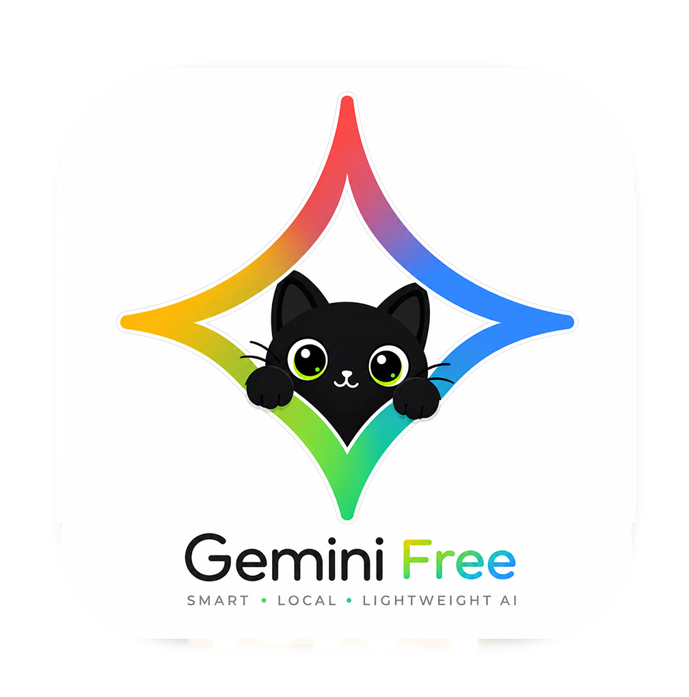

<p align="center">
  
</p>

<h1 align="center">Gemini Free</h1>

macOS 菜单栏应用，把 Gemini 网页端转成本地 OpenAI / Anthropic Messages 兼容 API。纯 Swift，内存占用约 14MB。

基于 [gemini-web2api](https://github.com/Sophomoresty/gemini-web2api) 的协议逆向逻辑重写。

## 下载

[Releases](../../releases/latest) 页有两种包：`GeminiFree.dmg`（拖入 Applications 安装，推荐）或 `GeminiFree-macOS.zip`。通用二进制，Intel 和 Apple 芯片的 Mac 都能跑。

## 用法

双击 `Gemini Free.app`，菜单栏出现图标，服务起在 `localhost:8081`。

客户端填：Base URL `http://localhost:8081/v1`，Model 填 `gemini-3.6-flash`。

```bash
curl http://localhost:8081/v1/chat/completions \
  -H "Content-Type: application/json" \
  -d '{"model":"gemini-3.6-flash","messages":[{"role":"user","content":"你好"}]}'
```

流式输出需在请求中设置 `"stream": true`：

```bash
curl -N http://localhost:8081/v1/chat/completions \
  -H "Content-Type: application/json" \
  -d '{"model":"gemini-3.6-flash","stream":true,"messages":[{"role":"user","content":"你好"}]}'
```

## Claude Code 与工具调用

Gemini Free 实现了 Claude Code 使用的 `POST /v1/messages` 与 `POST /v1/messages/count_tokens`。Claude Code 发来的 `input_schema` 会转换为 Gemini 网页端可理解的本地工具协议；Gemini 返回的调用会转换为 Anthropic `tool_use` 内容块，Claude Code 执行工具后发回的 `tool_result` 也会进入下一轮上下文。

先启动 Gemini Free，然后从同一个终端启动 Claude Code：

```bash
export ANTHROPIC_BASE_URL=http://127.0.0.1:8081
export ANTHROPIC_AUTH_TOKEN=gemini-free
export ANTHROPIC_CUSTOM_MODEL_OPTION=gemini-3.6-flash
export ANTHROPIC_CUSTOM_MODEL_OPTION_NAME="Gemini 3.6 Flash (Gemini Free)"
export ANTHROPIC_MODEL=gemini-3.6-flash
export ANTHROPIC_DEFAULT_MODEL=gemini-3.6-flash
claude
```

如果在 Gemini Free 设置里配置了 API Key，把 `gemini-free` 换成其中一个 Key；未配置时该占位 token 仅用于让 Claude Code 启用网关模式。可在 Claude Code 的 `/status` 中确认 `Anthropic base URL` 指向本机。

工具请求支持非流式响应和 Anthropic SSE 事件序列，包括 `tool_use`、`input_json_delta`、`tool_result` 续轮与 `stop_reason: tool_use`。由于 Gemini 网页接口没有公开任意函数声明能力，本项目通过严格的结构化提示词实现工具调用；带工具的响应需等模型完整生成后才能解析。模型生成畸形参数或调用未声明工具时，接口会明确返回 `502`，不会把错误伪装成普通文本。

普通对话会以 OpenAI 兼容的 SSE 增量返回。工具调用需要先完整解析模型生成的 `tool_call` 块，因此可能在生成完成后才返回；客户端固定传入空的 `"tools": []` 不会影响普通对话的流式输出。

首次打开若提示"已损坏"或无法验证开发者，在终端跑一次：

```bash
xattr -dr com.apple.quarantine "Gemini Free.app"
```

（App 用 ad-hoc 签名、未做 Apple 公证，这是正常现象，跑一次即可。）

## 模型

免登录：`gemini-3.8-flash` `gemini-3.7-flash` `gemini-3.6-flash` `gemini-3.5-flash` `gemini-3.5-flash-thinking` `gemini-3.5-flash-thinking-lite` `gemini-auto` `gemini-flash-lite`

要 Gemini Advanced 付费 cookie：`gemini-3.1-pro` `gemini-3.1-pro-enhanced`（没 cookie 也能调，静默回退 Flash）

思考深度：模型名后加 `@think=N`，0 最深 4 最浅。

## 设置

点菜单栏图标 → 设置，可改端口、局域网开关、API Key 鉴权、Cookie 文件、代理、默认模型。配置存 `~/.config/gemini-web2api/config.json`，格式和原项目通用。

- **局域网访问**：默认开启（监听 0.0.0.0），同网段设备可用本机 IP 调用；关闭则仅本机（127.0.0.1）。
- **API Key 鉴权**：填一个或多个 Key（逗号分隔），客户端需带 `Authorization: Bearer <key>`；留空则免密。开放局域网时建议设置。

代理填 `http://127.0.0.1:7890` 这类 HTTP 代理即可。

## 编译

```bash
./build.sh
```

## 致谢

Gemini 网页协议逆向来自 [Sophomoresty/gemini-web2api](https://github.com/Sophomoresty/gemini-web2api)。Anthropic Messages 与工具事件映射参考了 [gemini-for-claude-code](https://github.com/coffeegrind123/gemini-for-claude-code)、[UniClaudeProxy](https://github.com/vibheksoni/UniClaudeProxy) 和 [Anthropic 官方流式协议](https://platform.claude.com/docs/en/build-with-claude/streaming)。

MIT
